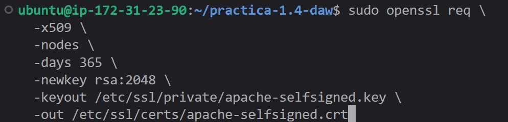
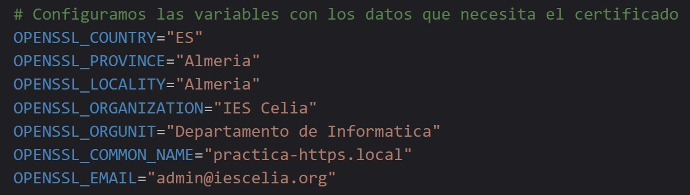
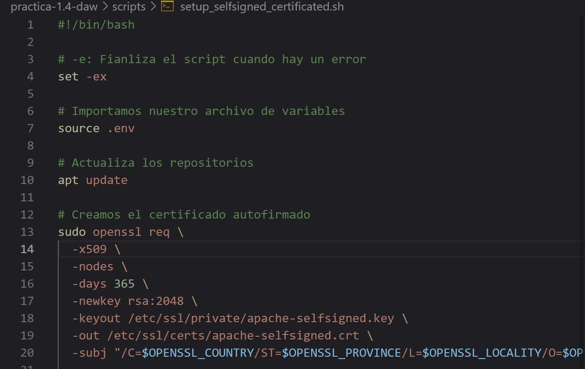
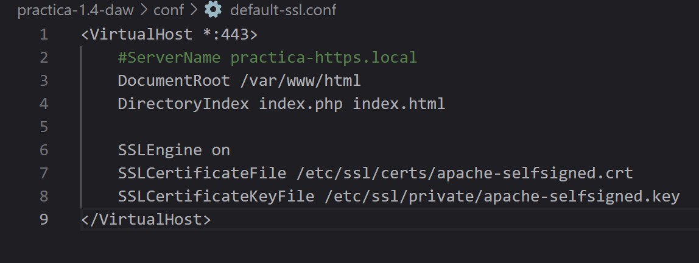
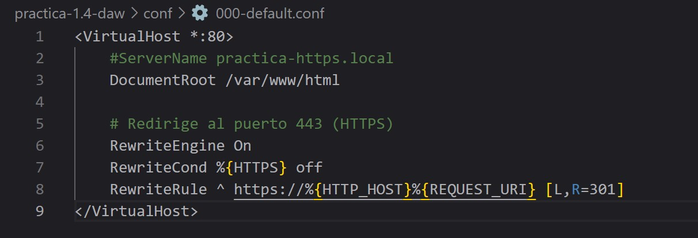
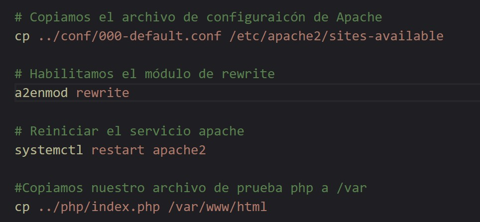
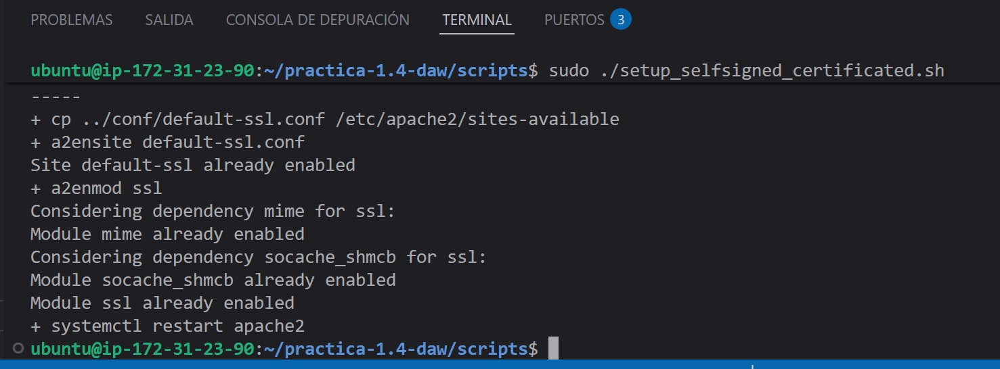
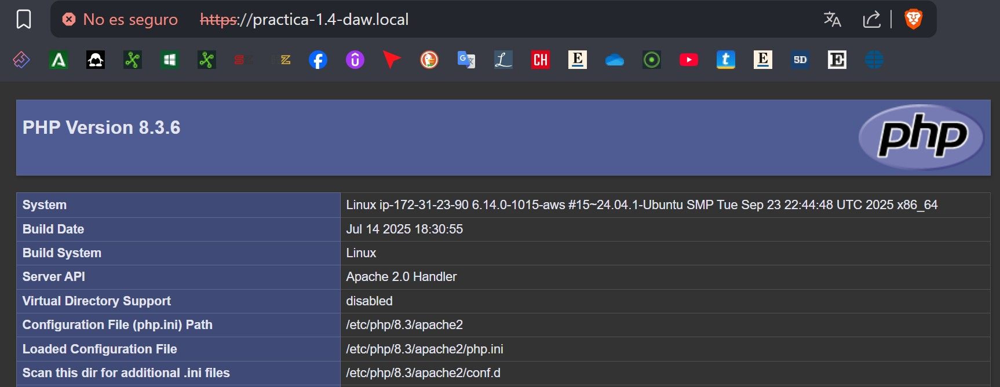
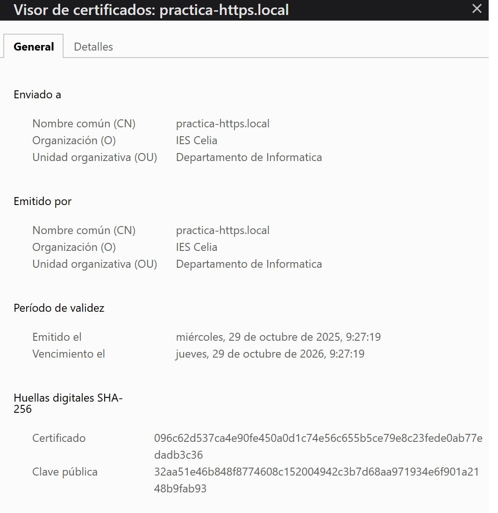

# PRÁCTICA  1.4

## 1. Creacion del certificado autofirmado:
Una vez instalado apache, creo un certificado autofirmado utilizando el comando openssl.

## 2. Genero y configuro el archivo .env:
Ahora creo el archivo de configuración dentro de la carpeta scripts .env para generar variables de entornon que se añadirán al certificado.

* Código del país de 2 caracteres 
* Provincia donde se emite el certificado.
* Localidad donde se emite el certificado.
* Nombre de la organización para la que se emite el certificado.
* Nombre de la unidad o sección de la organización.
* Nombre del dominio para el que se emite el certificado.
* Email.
  

## 3. Creacion de Script Setup_Selfsigned_certificated:
Realizo la creación de este Script para automatizar la creación del certificado, con la instrución opnssl, pero esta vez haciendo uso del parámetro -subj para introducir las variables de entorno del archivo .env. Ejemplo:

## 4. Configuración de un VirtualHost con SSL/TSL
Edito el archivo de configuración del virtual-host donde queremos habilitar el tráfico HTTPS. En este caso, utilizo el archivo de configuración que tiene Apache por defecto para SSL/TLS, que está en la ruta: /etc/apache2/sites-available/default-ssl.conf. Imagen del virtual-host: 
 

Después lo habilito con: **sudo a2ensite default-ssl.conf**, luego habilito el módulo SSL en Apache: **sudo a2enmod ssl** y, por último configuro el virtual host de HTTP para que redirija todo el tráfico a HTTPS. En esta ocasión, el virtual host que maneja las peticiones HTTP está en el archivo de configuración que utiliza Apache por defecto para el puerto 80: **/etc/apache2/sites-available/000-default.conf.**
Contenido del otro archivo virtual host:
 

## 5. Habilitamos módulo rewrite y reinciamos:
Para que el servidor web Apache pueda hacer la redirección de HTTP a HTTPS es necesario habilitar el módulo rewrite en Apache, así: **sudo a2enmod rewrite**, y reinicio el servidor apache para aplicar los
cambios: **sudo systemctl restart apache2**. 
Imagen de los conmandos en el Script:
 

## Demostración de la correcta ejecución del Script final:
 

## Demostración de la redireccion_Protocolo_HTTPS_con_dominio:
 

## Vista del CA:
 

